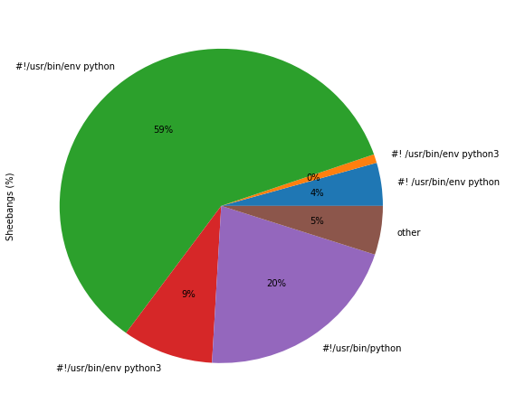
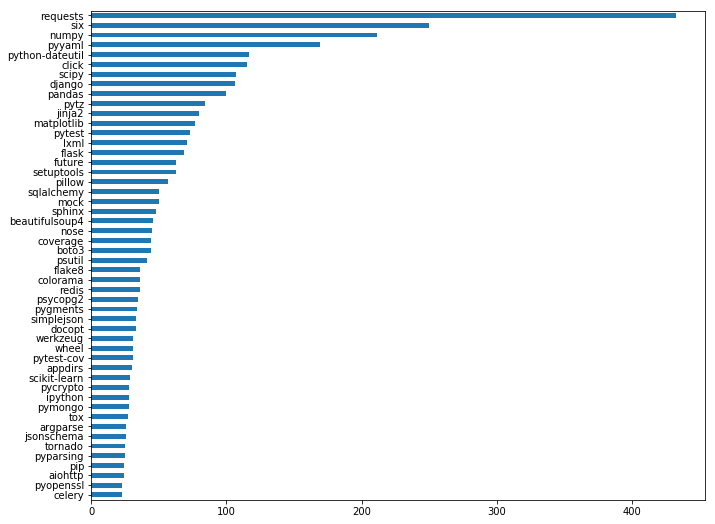

================================
Some stats about Python projects
================================

This is generated using `pystyle
<https://github.com/julienpalard/pystyle/>`_, it's only representative
of ``Python`` projects publicly available in ``pypi``.

Stats
-----

Licenses
~~~~~~~~

.. image:: plots/licenses.png

README extensions
~~~~~~~~~~~~~~~~~

.. image:: plots/readme.png

Languages (pct in each project)
~~~~~~~~~~~~~~~~~~~~~~~~~~~~~~~

.. image:: plots/loc.png

Shebangs
~~~~~~~~

Top 50 requirements
~~~~~~~~~~~~~~~~~~~

TODO
----

Lots of "style metrics" are to be added like:

- supported Python versions
- test engine used
- last commit
- number of github stars and forks
- number of open issues
- number of commits
