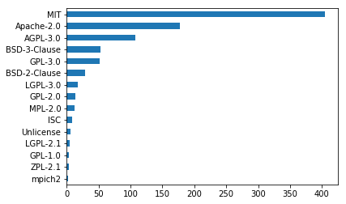
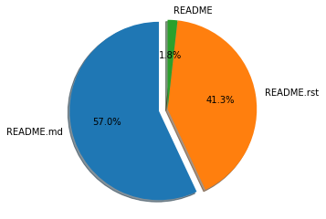
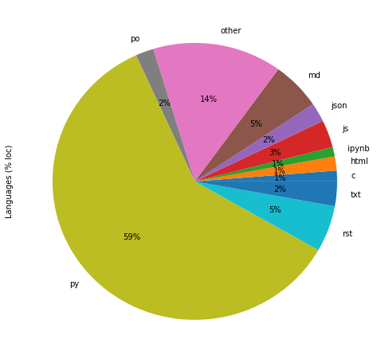

================================
Some stats about Python projects
================================

This is generated using `pystyle
<https://github.com/julienpalard/pystyle/>`_, it's only representative
of ``Python`` projects publicly available in ``pypi``.

Stats
-----

What kind of licenses are used by Python projects:

What kind of extensions are used in README files:

What kind of languages, as a percentage by project, are used:

TODO
----

Lots of "style metrics" are to be added like:

- supported Python versions
- test engine used
- last commit
- number of github stars and forks
- number of open issues
- number of commits
